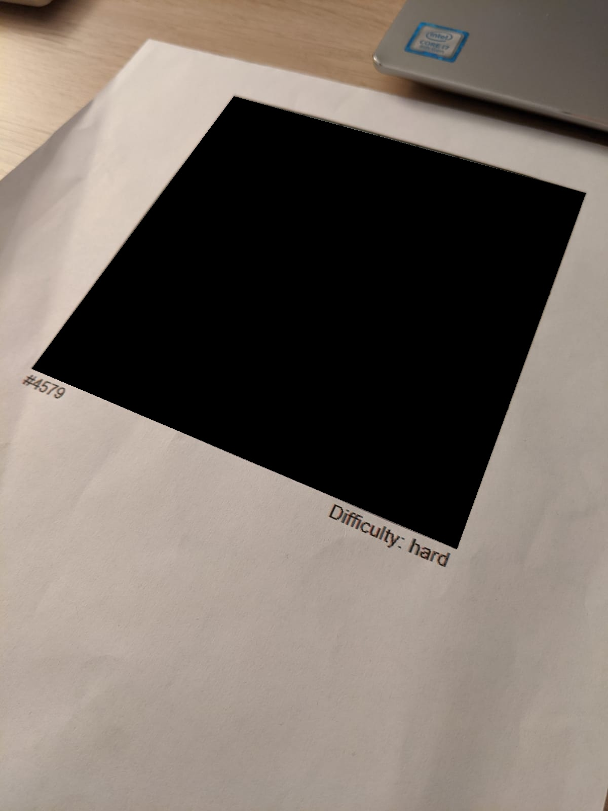

# OCR-Sudoku-Solver

OCR Sudoku Solver.

Receive an input image:

Apply image processing to make board extraction easier:

Extract the board from original image and apply perspective warp to obtain top-down view:

Extract the digits and solve the board if found:

Unwarp back the image:

Fill with black the area in the original image where the board resides in:

Paste the unwarped solution:

## Sources:
* https://www.kaggle.com/elcaiseri/mnist-simple-cnn-keras-accuracy-0-99-top-1
* https://stackoverflow.com/questions/57636399/how-to-detect-sudoku-grid-board-in-opencv
* https://norvig.com/sudoku.html